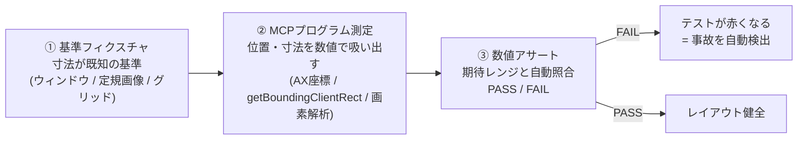
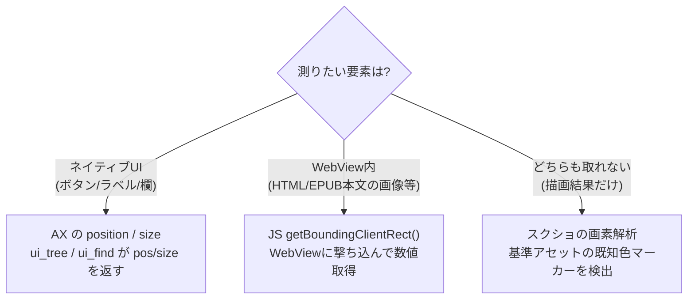
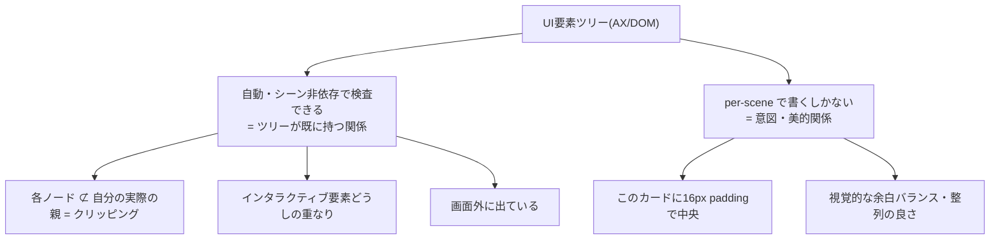

# レイアウトQA手法：基準フィクスチャ＋MCPプログラム測定＋数値アサート

デスクトップアプリの「見た目でしか分からない」品質（ボタン位置・余白・画像配置・要素の寸法）を、
**目視でなく数値で自動検証**するための方法論。ボタンが変な位置に飛ぶ・余白が崩れるといった
レイアウト事故を、人間が気づく前に機械で捕まえる。

---

## 1. なぜ必要か

従来のやり方（目視）には穴がある：

```
    レイアウトを変更
          │
          ▼
    スクショを人が見る  ←── 見落とす / 主観的 / 毎回やらない
          │
          ▼
    「だいたい合ってる」で通過
          │
          ▼
    数日後、ボタンが左下に吹っ飛んでるのに気づく
```

「だいたい合ってる」を **「x=913.2, 期待 24±8pt でPASS」** という数字と合否に置き換える。
これが本手法の目的。

---

## 2. 全体の流れ（3ステップ）



| ステップ | 意味 | たとえ |
|---|---|---|
| ① 基準フィクスチャ | 正解の寸法が分かっているテスト用の型紙 | 目盛りが既知の物差し |
| ② MCPプログラム測定 | UI要素の座標・寸法をコードで取得 | 物差しを当てて mm を読む |
| ③ 数値アサート | 実測を期待値と自動照合して合否 | 「10mm±1 か？」を判定 |

一言でいうと **「目視“だいたい合ってる”を、数字＋if文に置き換える」**。

---

## 3. 具体例：「本を追加」ボタンの位置を測る

実際に AX で測定した本物の数値（EpubReaderSpike）：

```
window   pos=(0, 118)        size = 1000 × 680
本を追加  pos=(913.2, 158.8)   size = 68.5 × 16.2
```

座標の関係を図にすると：

```
 (0,118) ┌─────────────────────────────────────────────┐
         │  書棚                          [ 本を追加 ]  │ ← ヘッダ帯
         │                                 ▲       ▲   │
         │                     x=913.2 ────┘       │   │
         │                     右端 = 913.2+68.5 = 981.7
         │                                         │   │
         │                          右端余白 = 1000 − 981.7 = 18.2pt
         │                                             │
         │                (書棚グリッド)                │
         │                                             │
 (0,798) └─────────────────────────────────────────────┘
         0                                          1000 (=win右端)
```

これを数値アサートにかける：

```python
win_right = win.x + win.w            # 0    + 1000  = 1000
btn_right = btn.x + btn.w            # 913.2 + 68.5 = 981.7
right_margin = win_right - btn_right # = 18.2pt

assert abs(right_margin - 24.0) <= 8.0   # 期待 24±8pt
top = btn.y - win.y                       # 158.8 − 118 = 40.8pt
assert top < 80                           # ヘッダ帯の中にある
```

実行結果：

```
[アサート1] ボタン右端余白 = 18.2pt / 期待 24±8 → PASS
[アサート2] ボタンのヘッダ内Y = 40.8pt (<80)   → PASS
```

---

## 4. これが効く理由（回帰検出）

後日レイアウトを触って **ボタンが左下に吹っ飛んだ** とする：

```
   変更前 (正常)                      変更後 (事故)
 ┌──────────────────┐            ┌──────────────────┐
 │ 書棚      [追加]  │            │ 書棚              │
 │                  │            │                  │
 │                  │    ──►     │                  │
 │                  │            │                  │
 │                  │            │ [追加]           │  ← 飛んだ
 └──────────────────┘            └──────────────────┘
  余白=18p., Y=41p. → PASS         余白=930pt, Y=600pt → FAIL
```

| 指標 | 正常 | 事故 | 判定 |
|---|---|---|---|
| 右端余白 | 18.2pt | 930pt | **FAIL** |
| ヘッダ内Y | 40.8pt | 600pt | **FAIL** |

人間がスクショを見る前に、**テストが勝手に赤くなる**。これが目視→数値化の価値。

---

## 5. 測定手段は3段構え

対象がどこにあるかで測定方法を選ぶ：



| 対象 | 手段 | 精度 |
|---|---|---|
| ネイティブ要素 | AX の pos/size | 高（pt単位） |
| WebView 内（foliate-js 本文） | JS `getBoundingClientRect()` | 高（px単位） |
| 描画結果しか無い | スクショの画素解析（フィデューシャル検出） | 中（±数px） |

> **基準フィクスチャの例**：寸法が既知の「測定用メジャー本」EPUB（定規・グリッド画像）を読み込ませ、
> 本文レンダリング後にその画像の位置・余白を測る。目盛りが既知なのでズレが数値で出る。

---

## 6. 実装との対応（epub-test MCP）

本手法は専用の道具立てが要らない。既存の MCP テスト基盤にそのまま乗る：

| 手法の要素 | epub-test MCP での実体 |
|---|---|
| ネイティブ要素の測定 | `ui_find` / `ui_tree`（`pos` / `size` を数値で返す） |
| WebView内の測定 | `app_cmd`（TestBus）に `measureImage` 等を追加し getBoundingClientRect を実行 |
| 基準フィクスチャ | テスト用アセット（測定用メジャー本 EPUB 等）をテストキットに同梱 |
| 数値アサート | テストスクリプト側で期待レンジと照合 |

---

## 7. 新規アプリでのチェックリスト

- [ ] レイアウト検証用の **基準フィクスチャ**（定規/グリッド/既知寸法アセット）を用意した
- [ ] UIの **座標・寸法を数値で取る測定口** を MCP に用意した（ネイティブ=AX / WebView=JS / 最後の手段=画素解析）
- [ ] 主要要素に **数値アサート**（期待値±許容差）を書いた
- [ ] レイアウトを触るたびにアサートが回り、**位置ズレで自動FAIL**する状態になっている
- [ ] fiducial オーバーレイ（定規/16色帯）を**測定器**として用意した（下記 §9〜11。目視の代用ではない）

---

## 8. 要点

- 核心は「メジャー画像を重ねる」ことではなく、**既知ジオメトリ＋プログラム測定＋数値アサート**。
- メジャー画像（重ね合わせ）は基準フィクスチャの**一形態**であり、かつ **AXが見逃す失敗を潰す独立した測定器**（§10）。
- 座標を if 文にするだけで、幾何学的な事故は自動で赤くなる。ただし**アサートには天井がある**（§9）。

---

## 9. アサート手法の天井 —「はみ出し」以外は画一的にやれない

数値アサートは「ウィンドウのコンテンツ領域」のような**固定の基準枠**に対しては強い。しかし
**要素が複雑に重なる**シーン（例: ボタンがパネルに乗っている）では、画一的には効かない。理由は2つ：

1. **どの枠が"意図した親"かは幾何学から出てこない。** 「このボタンはこのパネルに乗るべき」は
   **設計意図**であって座標には書いていない。誰かが「この対を検査せよ」と教える必要がある。
2. **意味のある関係が組み合わせ爆発する。** N 要素の包含・重なりの対は N² 的に増え、そのうち
   "どれが問題か" は intent 依存。全部は自動列挙できない。

### 切り分け：自動でやれる部分 / 人力の部分



- **自動でやれる**（親子ネストはツリーが持っている）: 「各ノードが"自分の実際の親"の枠からはみ出していないか」
  「インタラクティブ要素の重なり」「画面外」——**ツリーを一巡りするだけでシーン非依存に検査できる**。
  ツリーが既に持つ情報を手書きアサートで再発明しないこと。
- **人力（per-scene）でしか書けない**: 「意図した親との関係」「特定 padding で中央」など **設計意図**の部分。

この人力部分こそ、次の fiducial／視覚判定が効く領域。

---

## 10. Fiducial オーバーレイは「目視の代用」ではなく「AXが見逃す失敗を潰す測定器」

定規や **16色を順に並べた帯** を描画に重ねる手法は、AX/DOM の rect 読みが**構造的に見逃す**2つの失敗を潰す。


### AX rect 読みの2つの盲点

1. **要素の矩形は"正しい"のに、描かれた絵はズレている。** `object-fit`・padding・transform・サブピクセル・
   WebView 内の画像——コンテナは全幅でも中の絵は左に寄る。**rect を読むと「余白あり」と出るのに目には無い。**
   これが「両サイド余白がほしいのに無い → なのに"余白できました"と誤報告」の温床。AIは rect(意図)を見て報告し、
   paint(実際の見た目)を見ていない。
2. **discrete な要素が無い描画**（画像の中身・背景・キャンバス）には rect が存在せず、測りようがない。

### fiducial が解くこと

- **paint そのものを測る**：座標系を"描画されたピクセル"に刻み込むので、スクショから絶対座標が読める。
  model(意図) ではなく paint(現実) を測る。
- **AIの知覚特性に合う**：AI視覚は「42px」の絶対距離は苦手だが、「シアンの帯に一致」「3本目の目盛り」の
  **記号的・相対的判断は得意**。16色帯は各位置に一意のランドマークを与え、数えずに一発で位置が言える。
  色は圧縮・拡大に強く、**人の目・AIの目・解析コードの3者が同じ物差しを読める**。
- **アンチ・ハルシネーション装置**：「やったつもり」の誤報告に対し、強制的に ground-truth を読ませる。
  実測（帯の位置）が意図と矛盾すれば、その場で嘘がバレる。

> つまり fiducial は vision の否定ではなく **vision の補助線（増感剤）**。Tesla も路面のレーンマーキングという
> "環境に刻まれた記号" に依存する。**環境を視覚に読みやすくする**のは vision-first と矛盾しない。
> モデルが賢くなるほど不要になっていく**足場（vestigial）** として、外しやすく設計する。

---

## 11. 知覚 ≠ 検証 — 分業と、vision-first への向き合い方

「AIは視覚情報から直接判定できる方が賢くなる」（Tesla FSD 的な end-to-end vision の思想）は、
**方向としては正しい**。一般化する／ユーザーが体験する画素そのものを最適化する／bitter lesson（計算とデータで
スケールする汎用手法が手作り知識に長期で勝つ）に沿う。ただし**現行のマルチモーダルは metric 精度が弱く**、
「2px 中央からズレ」を今はまだ外す——**純粋 vision-first は、まさにその実害には今は効かない**。

だから役割を分ける：

| 役割 | 何を担うか | 実装 | 長期の向き |
|---|---|---|---|
| **知覚（Perception）** | 一般化した「なんか変」の判定。intent・美的関係 | 視覚モデル＋fiducial で精度を底上げ | vision に寄せる（マスクの方向） |
| **検証（Verification）** | 回帰の門番・反ハルシネーション | 決定論的な測定/アサート（AX座標・overflow・画素解析） | モデルから独立した審判として残す |

- たとえ視覚が完璧になっても、**回帰テストの ground-truth オラクル**は別に要る。「モデルが見て大丈夫と言った」は
  そのモデル自身が幻覚しうる以上、門番にできない。決定論的測定は**独立した審判**として価値が残る。
- **今やる最高レバレッジは fiducial**：現行モデルの精度の穴を、モデル進化を待たずに埋める橋渡し。
- **足場は薄れる前提で設計する**：vision-first は長期の弧として賭ける価値があるが、今日の作業を全部それに
  賭けると壊れる。足場（fiducial・アサート）を組みながら移行する、が工学的な答え。
