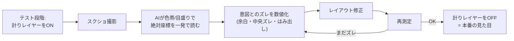
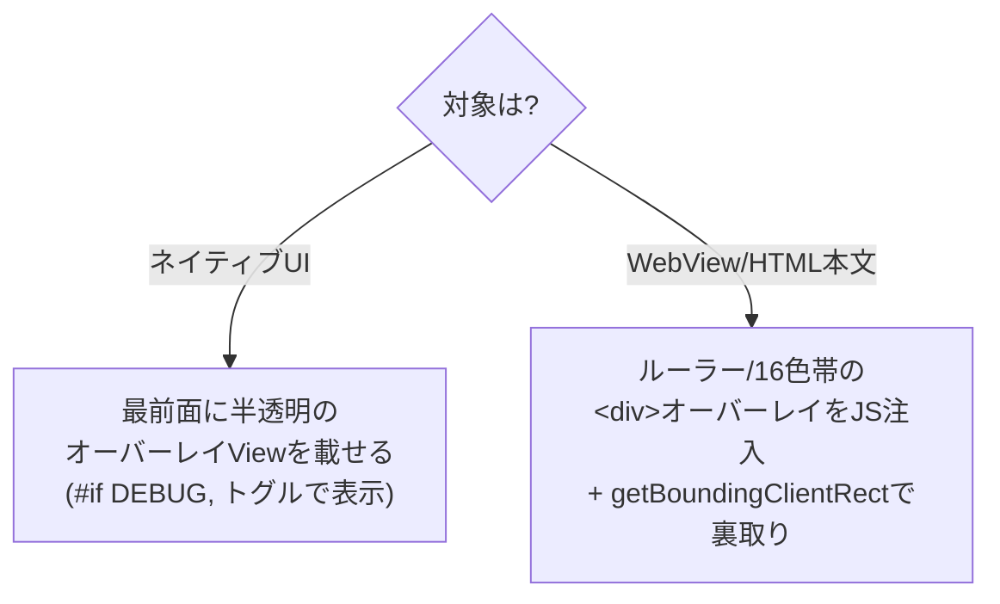

# 測定オーバーレイ手法 — テスト段階だけ「計り」レイヤーを重ねてレイアウトを直す

UI の上に、**座標が読み取れる"物差し"のレイヤー**（定規／16色帯のフィデューシャル）を
**テスト段階だけ**重ねる。AI はそのレイヤーを見て要素の絶対座標を一発で読み、ズレを数値で直す。
直し終えたらレイヤーを外す＝本番。

> この文書は「どう作って、どう使い、どう外すか」の実践編。
> **なぜ効くか**の理論（AX rect の盲点／AIの知覚特性／知覚と検証の分業）は
> [layout-qa-methodology.md](layout-qa-methodology.md) の §10〜11 を参照。

---

## 1. 何を重ねるのか（計りレイヤーの中身）

画面の一番上に、半透明で載せる測定用のレイヤー。3要素を持つ：

```
        ┌─ 上辺ルーラー：X座標の目盛り＋16色帯 ─────────────────┐
        0    62   125  ...                              937  1000
      ┌─┼────┼────┼────┼────┼────┼────┼────┼────┼────┼────┼─┐
  0 ─ │0│ 赤 │ 橙 │ 黄 │ 黄緑│ 緑 │ 青緑│ 水 │ 青 │ ... │紫│  ← X帯 (band0..15)
      │─┤                                                  │
 左辺 │1│                                                  │
 ルー │2│              (この下に実際のUI)                    │
 ラー │3│                                    ┌─────────┐   │
 Y帯  │4│                                    │本を追加 │   │ ← 右端が band14(水色帯)
      │5│                                    └─────────┘   │
      │…│                                                  │
      └─┴──────────────────────────────────────────────────┘
        ▲原点マーカー(左上に十字の登録マーク)
```

| 要素 | 役割 |
|---|---|
| **原点/登録マーカー** | 座標の基準点(0,0)を画面に固定。オーバーレイ自身のズレを検出 |
| **ルーラー(目盛り)** | 数値を直接読む。細かい精度用 |
| **16色帯（フィデューシャル）** | 各位置に一意の色。AIが「右端は水色帯＝band14」と数えずに一発で言える |

X軸を上辺の16色帯、Y軸を左辺の16色帯で符号化すると、任意の点の座標が
**「横=どの色帯の下か × 縦=どの色帯の横か」** で言える。

---

## 2. なぜ「16色帯」なのか

数字の目盛りだけでなく**色の帯**を併用するのが肝。AIの視覚は
「これは何px」という**絶対距離は苦手**だが、「この帯は水色＝14番目」という
**記号的・相対的な判断は得意**（理論は methodology §10）。色帯は：

- **一意なランドマーク**：各帯が違う色 → 端がどの帯に乗るか、数えずに即答できる
- **圧縮・拡大に強い**：スクショが縮小/JPEG圧縮されても色は判別しやすい
- **人・AI・解析コードが同じ物差しを読める**：コード側も「既知RGBの帯の位置」を検出するだけ

### 色→座標の対応（幅1000pxを16分割＝1帯62.5pxの例）

| band | 色(目安) | X範囲(px) |
|---|---|---|
| 0 | 赤 #E6194B | 0–62 |
| 1 | 橙 #F58231 | 62–125 |
| 2 | 黄 #FFE119 | 125–187 |
| … | … | … |
| 13 | 青 #4363D8 | 812–875 |
| 14 | 水 #42D4F4 | 875–937 |
| 15 | 紫 #911EB4 | 937–1000 |

> 例：「本を追加」ボタンの右端は実測 x≈981.7px → **band15(紫)** に入る。
> AIはスクショで「右端は紫帯」と読むだけで、右端が画面右端(band15)まで来ている＝
> **右余白がほぼ無い**と即座に判定できる。

---

## 3. 使い方のワークフロー



ポイントは **修正のたびに再測定**して、AIが「直したつもり」ではなく
**計りの上で数値が合ったこと**を確認してから次へ進むこと（アンチ・ハルシネーション）。

---

## 4. 典型的な直し方（よくある症状への対応）

| 症状 | 計りレイヤーでの読み方 | 修正の指標 |
|---|---|---|
| 両サイドに余白がほしいのに無い | 左端が band0、右端が band15 に張り付いている | 左端を band1、右端を band14 に入れる |
| 微妙に中央からズレ | 左ギャップ=band差2、右ギャップ=band差1 と非対称 | 左右のギャップ帯数を揃える |
| 上に余白がほしいのにズレ | 上端が Y帯 band0 に接触 | 上端を Y帯 band1 以降へ |
| パネルからボタンがはみ出す | ボタン右端の色帯 > パネル右端の色帯 | ボタン右端の帯 ≤ パネル右端の帯 に収める |

---

## 5. 実装の形（テスト段階だけ・外せること）

計りレイヤーは**本番に混ぜない**。DEBUG限定でトグルできるようにする。



- **ネイティブ**：最前面に半透明のルーラー/色帯オーバーレイを重ねる。`#if DEBUG` かつトグル。
- **WebView(foliate-js 本文)**：ルーラー/16色帯の要素を JS で注入して重ねる。
  同時に `getBoundingClientRect()` で対象の座標も取れるので、**色帯(AIの目)と数値(コード)の両方**で裏が取れる。
- **既存の測定用アセット**（「測定用メジャー本」EPUB＝定規/グリッド画像）も、この計りレイヤーの一形態。

### MCP との接続

- `app_cmd` に「計りレイヤーON/OFF」「色帯注入」を足す → テストスクリプトから重ねられる。
- 重ねた状態で `screenshot`（前面化せず撮影）→ AI が色帯で読む。
- 数値裏取りは `ui_overflow` / `getBoundingClientRect`。

---

## 6. 本番から外す（vestigial 前提で設計）

- 計りレイヤーは**修正フェーズの足場**。合ったら OFF にして本番の見た目を確認する。
- 実装は `#if DEBUG` ＋トグルで、**外し忘れても本番ビルドに入らない**ようにする。
- モデルの視覚が賢くなるほど、この足場は要らなくなっていく（[methodology §11](layout-qa-methodology.md)）。
  だから**外しやすく作る**のが設計方針。

---

## 7. チェックリスト

- [ ] 計りレイヤー（ルーラー＋16色帯＋原点マーカー）を **DEBUG限定・トグル式**で用意した
- [ ] 色→座標の対応表を決めた（分割数・色・範囲）
- [ ] 「重ねる → 撮る → 色帯で読む → 数値で直す → 再測定」のループになっている
- [ ] 数値裏取り（`getBoundingClientRect` / `ui_overflow`）で色帯の読みを確認している
- [ ] 合ったらレイヤーを **OFF にして本番の見た目**を確認した
- [ ] レイヤーは本番ビルドに**入らない**（`#if DEBUG`）

---

## 8. 要点

- **テスト段階だけ、座標が読める"物差し"を UI に重ねる。** AIはそれを見て一発で座標を取り、数値で直す。
- 16色帯は、AIが苦手な「絶対距離」を得意な「記号的判断」に変換する装置。
- 計りレイヤーは **vision の補助線（増感剤）**であり、**外せる足場**として設計する。
- 直したら外す。本番には残さない。
